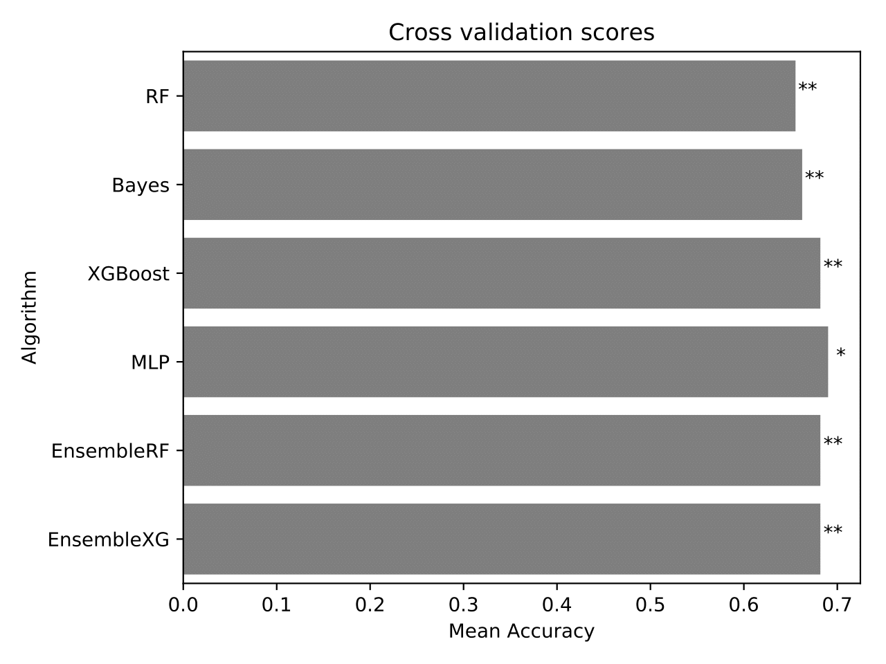
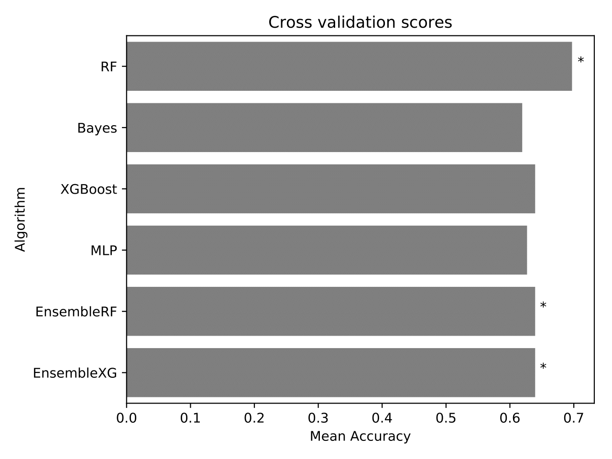
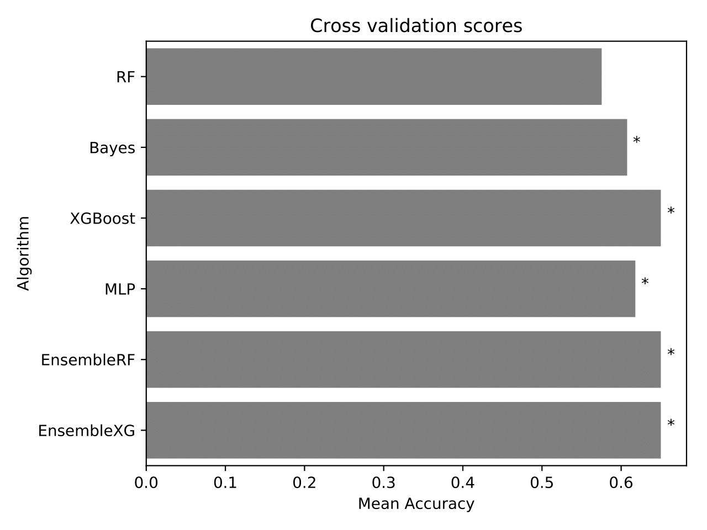

This model predicts genotype (HET vs EHMT1-) based on behavioural features in the OS task.

# Pipeline

# Preliminary results

### All data

### Per condition
**Control**

**Object Displacement**

**Object Reinforcement**

